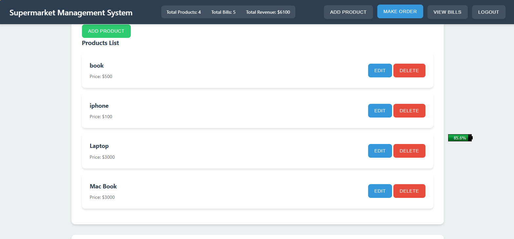
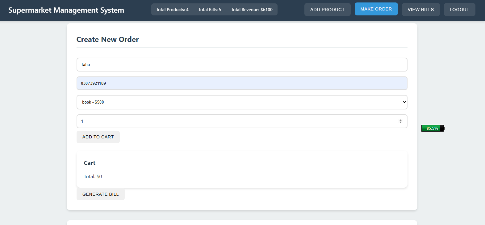

      <h1>  Supermarket Management System</h1>
      <h3>A Modern Retail Management Solution</h3>

    
    
    

# 📌 Overview

A comprehensive supermarket management system that streamlines product management, order processing, and billing operations. Built with modern web technologies, this system offers an intuitive interface for store administrators and staff.

# 🛠️ Tech Stack

## 🔴 Live Demo

Check out the live demo: [Supermarket Management System](https://jamalihassan0307.github.io/supermarket-management-system-wajahat/)

### Demo Credentials

- **Username:** demo
- **Password:** 1234

## 📸 Screenshots

### System Features

#### 1. Login Interface

_Secure authentication system for staff access_

#### 2. Product Management

_Comprehensive product listing and management interface_

#### 3. Add New Product

_Interface for adding new products to inventory_

#### 4. Create New Order

_Streamlined order creation process_

#### 5. Bill History

_Detailed billing history and transaction records_

## 🚀 Features

- **Product Management**

  - Add new products
  - Edit existing products
  - Update inventory
  - Product categorization

- **Order Processing**

  - Create new orders
  - Add multiple items
  - Calculate totals
  - Process transactions

- **Billing System**

  - Generate bills
  - View transaction history
  - Track daily revenue
  - Print receipts

- **User Management**

  - Secure login system
  - Role-based access
  - Session management

- **Dashboard**
  - Total products overview
  - Daily sales summary
  - Revenue statistics
  - Recent transactions

## 🛠️ Built With

- **Frontend**

  - HTML5
  - CSS3
  - Vanilla JavaScript

- **Storage**

  - LocalStorage for data persistence

- **Additional Features**
  - Responsive Design
  - Search Functionality
  - Real-time Updates

## 🙏 Acknowledgments

- [HTML5](https://developer.mozilla.org/en-US/docs/Web/HTML)
- [CSS3](https://developer.mozilla.org/en-US/docs/Web/CSS)
- [JavaScript](https://developer.mozilla.org/en-US/docs/Web/JavaScript)
